按[轻度使用](#轻度使用)和[重度使用](#重度使用)分别推荐，每种就推荐两三个，以供有不同需求的人参考。

极简总结：

- 🔥高性价比，小众新兴：[小鸡快跑，新兴机场，测速快得有点夸张，价格实惠，性价比高，值得一试](https://xiaojiv2.xiaojicf.com/#/register?invitecode=tqB3FCup)
- 🔥尝鲜偶用，预算较低：[一元机场，一个月不到 1 块钱，老牌廉价机场，推荐作为备用防失联](https://xn--4gq62f52gdss.ink/#/register?code=QFTTlbYU)
- 🔥重度依赖，流媒解锁：[TAG 全球 250+ 节点、99+ 流媒体解锁，覆盖地区最广的机场，贵但是好用](https://tagss04.pro/#/auth/2neqgxFl)
- 🔥喜欢看剧，自带Emby：[TLS 全球 50+ 节点，主打 Emby， 有 4K 资源，支持直连和 Infuse](https://tls.wiki/index.php#/register?code=ojo2nVBG)

强烈推荐[小鸡快跑](https://xiaojiv2.xiaojicf.com/#/register?invitecode=tqB3FCup)，性价比真的太高了！

## 轻度使用

- **预算低**，舍不得在这方面大支出
- 备用机场防失联
- 海淘、谷歌
- 偶尔看看 Youtube 等视频
- Telegram 聊天
- 基本没有速度和时延要求

### [一元机场](https://xn--4gq62f52gdss.ink/#/register?code=QFTTlbYU)🔥

官网：[👉链接🚀](https://xn--4gq62f52gdss.ink/#/register?code=QFTTlbYU)

协议：`Trojan`

特点：廉价，流量高，速度还行，但是不太稳定。

有点小名气的低价机场，主打的就是一个价格低。晚高峰会有点卡，稳定性也不算高，不过 12CNY/Year、20CNY/2Year 的价格要什么自行车，主要是速度也还行，解锁 Netflix 和 Disney+，美国节点解锁 ChatGPT。

他家就买这个传家宝套餐就行了。至于俩稍微贵点的高流量套餐，可以拿来当二道贩子，封装个 APP 卖钱😜。

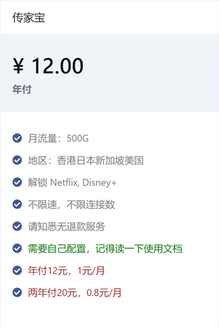

节点以香港、日本、美国、新加坡为主，偶尔会出现土耳其等特别的节点。

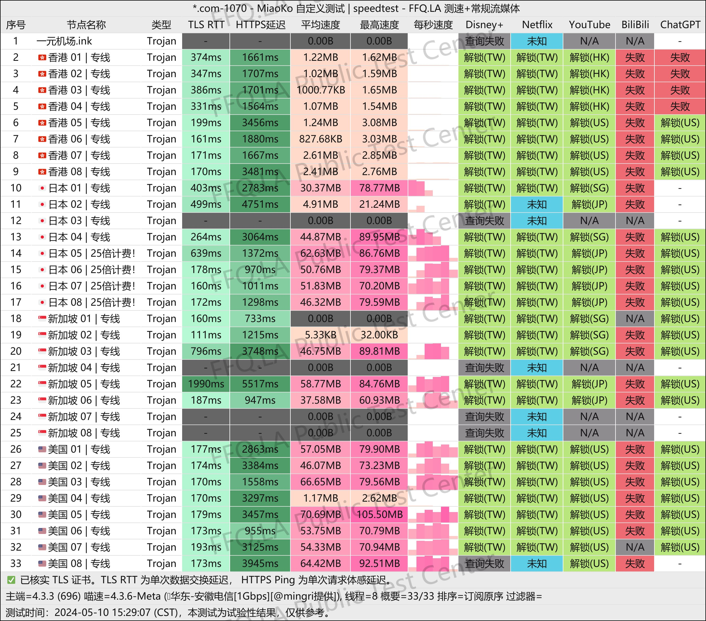

### [小鸡快跑](https://xiaojiv2.xiaojicf.com/#/register?invitecode=tqB3FCup)🔥🔥🔥

官网：[👉链接🚀](https://xiaojiv2.xiaojicf.com/#/register?invitecode=tqB3FCup)

协议：`Trojan`

特点：一家新兴的性价比翻墙机场，全节点 IPLC 专线，负载均衡，带宽冗余超过 2Gbps，测速最高能达 260MB/s，有不错的流媒体和 ChatGPT 解锁。

相对小众一点，价格适中，与几个大机场相比可以说是低价，重点是速度超越绝大多数机场，值得一试。

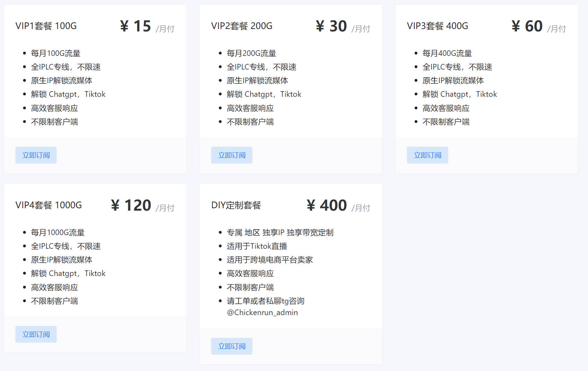

测速如下：

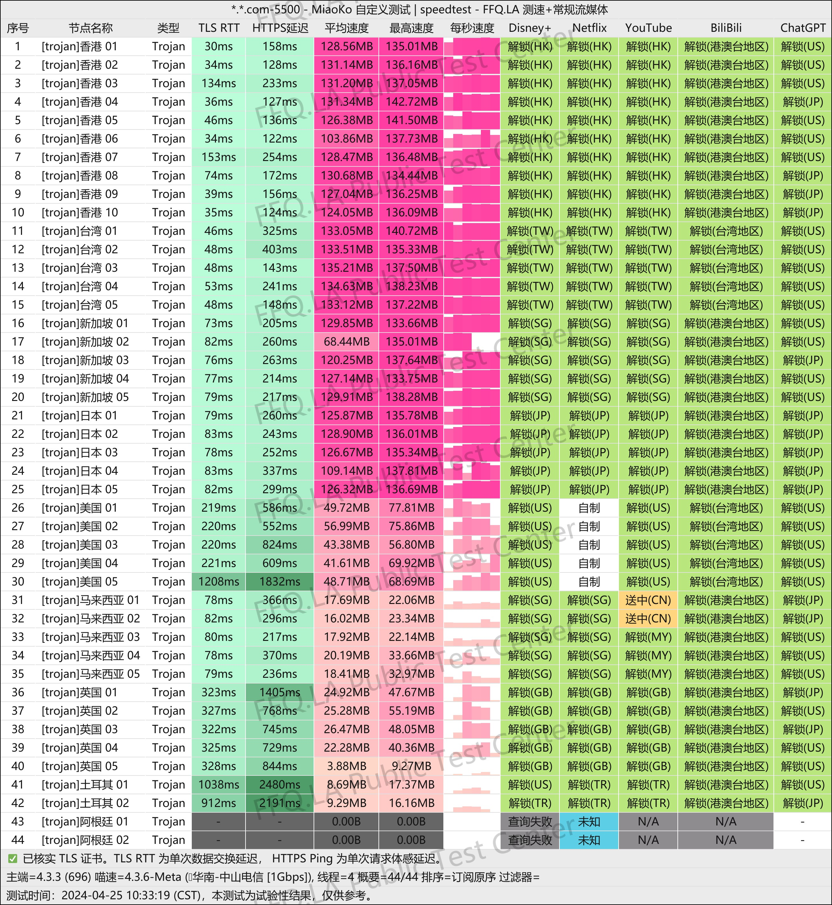

### [三分机场](https://ca.sanfen.me/#/register?code=FKnu6Hkg)

官网：[👉链接🚀](https://ca.sanfen.me/#/register?code=FKnu6Hkg)

协议：`VMESS`

特点：廉价，流量较少，速度还行，稳定性一般，相对小众一点。

和上面类似，也是靠低价起家的，后来也推出了中转套餐。

注意：`9.5CNY/Year 每月 200G` 的套餐目前已经没有了，仅剩下 `39.9CNY/Year 总流量 900G` 和 `5 CNY/Month 每月 5000G 流量`的低价套餐。

特别注意，直连套餐里有个小字说明：`福建福州、泉州、湖南和河南大部分地区此套餐可能无法使`，这些地区的小伙伴谨慎购买。

中转套餐就不太推荐了，最低 14.50CNY/Month，这个价格的话更推荐上面的 [小鸡快跑](https://xiaojiv2.xiaojicf.com/#/register?invitecode=tqB3FCup) 了。

目前节点包括香港、日本、美国、新加坡、台湾。

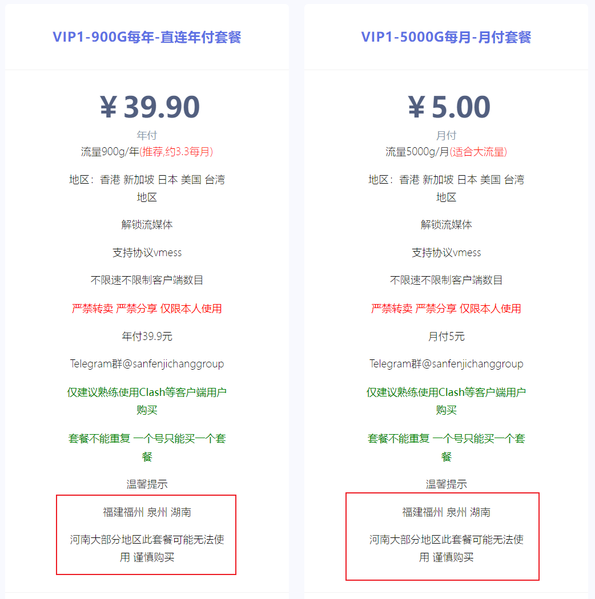

官方频道测速如下：

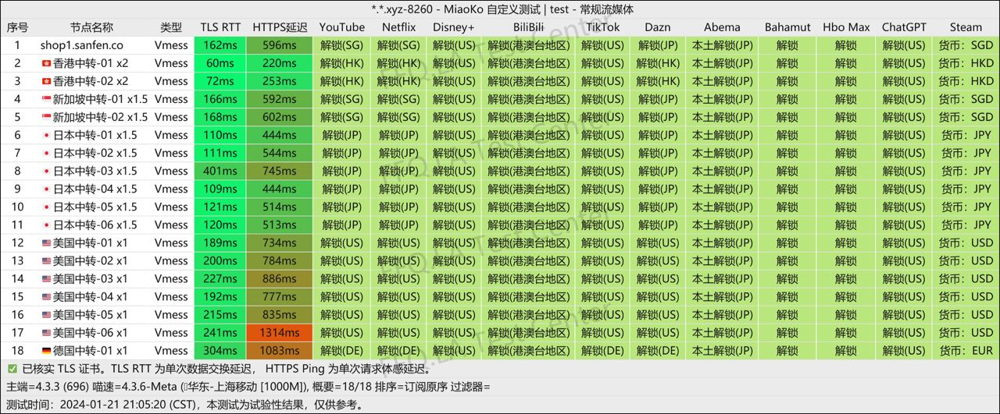

## 重度使用

- **不在乎价格**
- Netflix、Disney+ 等流媒体重度依赖
- 长期看不能直连的 Emby 公益服
- Telegram 上看视频
- 办公强依赖
- 追求**稳定性**
- **高速**和***低时延***要求

### [TAG ](https://tagss04.pro/#/auth/2neqgxFl)🔥🔥

官网：[👉链接🚀](https://tagss04.pro/#/auth/2neqgxFl)

协议：`Shadowsocks`

特点：比较贵，节点覆盖面广，速度较快，稳定。

**特别提醒：该机场禁用了 22 端口，这点对开发者不太友好，尤其影响 Git SSH，如果你是开发者则慎重购买。**

全球 250+ 节点、99+ 流媒体解锁，线路是全 BGP-IEPL 广港 + BGP-IEPL 沪日中转，全球 90+ 国家地区节点，**地区覆盖范围是最广的**，什么奇奇怪怪的国家地区都有，就连南极、美国星链也有。想象以下，发帖回帖，地区显示南极😁！

同样的 Netflix、Disney+ 等流媒体，该解锁的都解锁了，ChatGPT 也是。

他家有一个特别套餐，154CNY/Year，总共 200G 流量，用作备用防失联特别好，或者需要一些罕见地区的时候。

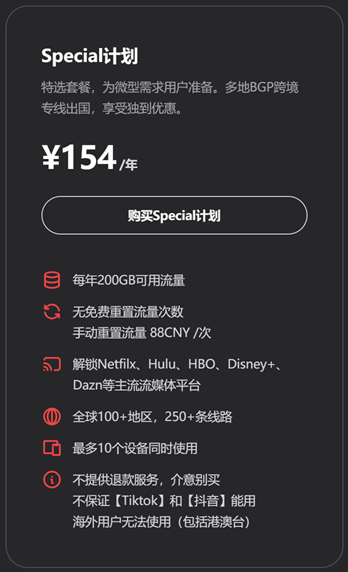

其他套餐价格如下：

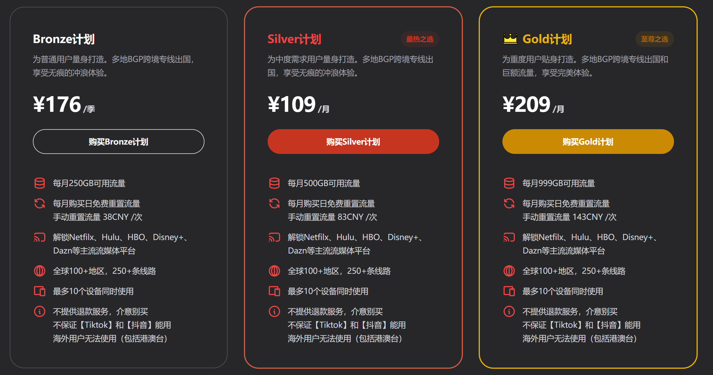

电信测速，可以参考下。

### [Nexitally](https://nexitally.net/)

官网1：[👉链接🚀](https://nexitally.net/)

官网2：[👉链接🚀](https://nexitallysafe.com/)

协议：`Shadowsocks`, `Trojan`

特点：昂贵，稳定，流量还行，速度快，晚高峰也稳定有速度。出问题的时候，也是自己把自己折腾挂了。

官网打不开的话先挂个别的代理。

[毒药](https://www.duyaoss.com/)推荐中的第一名，佩奇家中转线路的高端机场，成立大概三年多。稳定性和速度都不错，价格高，但是对于追求稳定性的用户也还好。

这也是我个人主要使用的，已经使用三年了，目前应该是第四年。

Netflix、Disney+ 等流媒体，该解锁的都解锁了，ChatGPT 也是可以正常用的。

有自己的傻瓜客户端，可以登录后一键连接。

套餐情况：

- Smart Access：每月 500G 流量，约 117CNY/Month，约 594CNY/Year，约 1102CNY/Year
- Smart Access Air：每月 200G 流量，价格是 Smart Access 的一半多点，但是`限量提供，能不能买到看缘分，买到后可以一直续费`

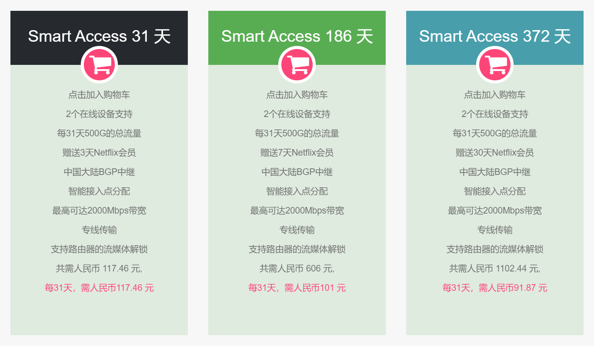

毒药的电信测速，可以参考下。

### [TLS](https://tls.wiki/index.php#/register?code=ojo2nVBG)

官网：[👉链接🚀](https://tls.wiki/index.php#/register?code=ojo2nVBG)

协议：`Shadowsocks`

特点：中高级套餐附带 Emby 且有 4K，价格适中，速度较快，相对稳定。`PS: Emby 高清和4K均已恢复，可以冲！······`

最大的特色是高级套餐附带 Emby 服务，提供了 4K 片源，并且直连 Emby 的速度也是不错的，不需要梯子就能直接看。影视库更新速度也挺快，最新电视剧集基本第二天就上了，基本可以替代国内视频平台。相对小众一点，客服态度也很好。

套餐除了翻墙套餐送 Emby 外，也单独提供了 Emby 套餐。

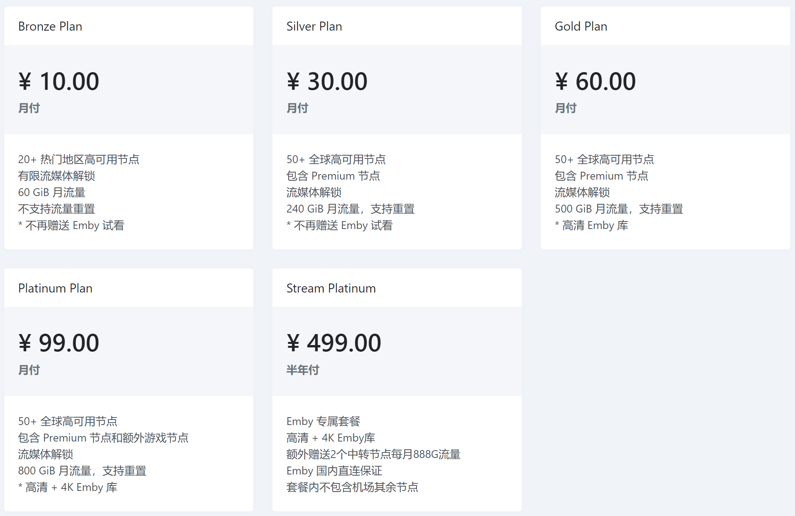

测速如下：

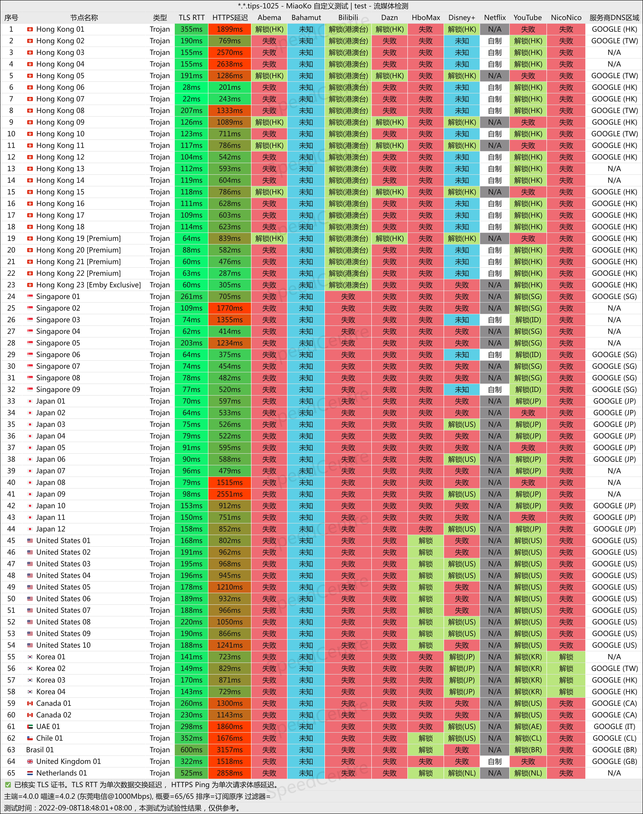

## 最后

对于刚接触科学上网的朋友，建议先买个廉价的梯子试试，确认自己是否有科学上网的需求、以及科学上网的依赖度有多大，如果确实有需求再考虑换高价稳定的梯子。

对于海淘的朋友，如果只看看商品不亲自购买，一元机场、三分机场这种完全够用，别信海淘群里那种倒卖的，说不定卖给你的就是这种。
