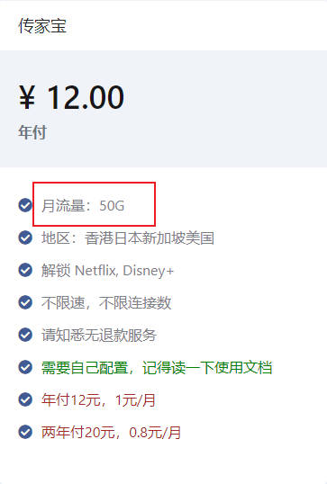
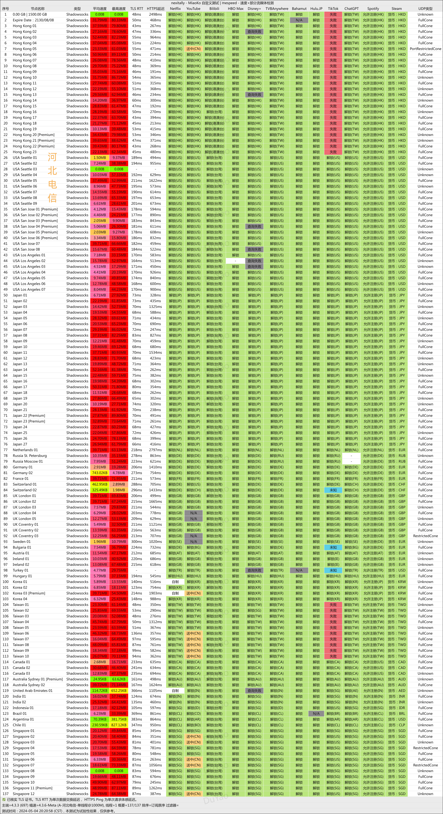

分类推荐，每种就推荐两三个，供有不同需求的人参考。

极简总结：

**国庆临近，优惠码会逐步刷新，请关注：**

| 🔥 | 个人需求 | 机场名称 | 机场特点 | 传送门 | 国庆优惠码 |
| ------ | ------ | ------ | ------ | ------ | ------ |
| 🔥 | 高性价比，小众新兴 | 小米梯子 | 新兴机场，2.5G 速率，价格实惠，性价比高，值得一试 | [🚀直达](https://xmin02.xiaomiaff.cc/register.html?invitecode=DBQFuexi) | 7折：xm70z |
| 🔥 | 尝鲜偶用，预算较低 | 一元机场 | 一个月不到 1 块钱，老牌廉价机场，推荐作为备用防失联 | [🚀直达](https://xn--4gq62f52gdss.ink/#/register?code=QFTTlbYU) | - |
| 🔥 | 重度依赖，长期稳定 | TAG | 全球 250+ 节点、99+ 流媒体解锁，覆盖地区最广的机场，虽贵但好用 | [🚀直达](https://tagss04.pro/#/auth/2neqgxFl) | - |
| 🔥 | 喜欢看剧，自带Emby | TLS | 主打 Emby， 有 4K 资源，支持直连和 Infuse，全球 50+ 节点 | [🚀直达](https://tls.wiki/index.php#/register?code=ojo2nVBG) | - |

流媒体解锁都支持的。当前强烈推荐**小米梯子**，稳定性好，性价比非常高！

目录：

- [特别推荐](#特别推荐)
  - [🔥小米梯子 —— 性价比至高之选](#小米梯子--性价比至高之选)
- [轻度使用](#轻度使用)
  - [🔥一元机场 —— 一个月1块钱](#一元机场--一个月1块钱)
  - [三分机场 —— 一天3分钱](#三分机场--一天3分钱)
- [中度使用](#中度使用)
  - [🔥小鸡快跑 —— 优质性价比机场](#小鸡快跑--优质性价比机场)
  - [银河云 —— 小众实惠](#银河云--小众实惠)
- [重度使用](#重度使用)
  - [🔥TAG —— 机场中的排头兵](#tag--机场中的排头兵)
  - [Nexitally —— 老牌机场佩奇家](#nexitally--老牌机场佩奇家)
- [特色机场](#特色机场)
  - [TLS —— Emby 4K](#tls--emby-4k)
- [最后](#最后)

## 特别推荐

个人认为非常好用且性价比贼高的机场。

### 🔥小米梯子 —— 性价比至高之选

全场7折优惠码：xm70z

官网：[👉链接🚀](https://xmin02.xiaomiaff.cc/register.html?invitecode=DBQFuexi)

协议：`Trojan`

特点：新兴的一家全中转 IPLC 翻墙机场，全节点 IPLC 专线，后端负载均衡、多种方式落地，2.5G速率，确保稳定性。不限速不限连接数！如果有特别需求，还可以私人定制。

ChatGPT/OpenAI/TikTok 解锁，Netflix/Disney+/Youtube/PCR等常规流媒体已解锁。

节点：香港、台湾、新加坡、日本、韩国、泰国、美国、法国、加拿大、马来西亚、英国、阿根廷、巴西等。

价格适中，稳定性好，地区节点覆盖多。不限速不限连接数，适合多设备、全家共同使用。

测速如下：

机场尚在优化调整中，优化完成后都能跑满速，测速图暂做参考，后续会刷新。

## 轻度使用

- **预算低**，舍不得在这方面大支出
- 备用机场防失联
- 海淘、谷歌
- 偶尔看看 Youtube 等视频
- Telegram 聊天
- 基本没有速度和时延要求

### 🔥一元机场 —— 一个月1块钱

官网：[👉链接🚀](https://xn--4gq62f52gdss.ink/#/register?code=QFTTlbYU)

协议：`Trojan`

特点：廉价，流量高，速度还行，但是不太稳定。

有点小名气的低价机场，主打的就是一个价格低。晚高峰会有点卡，稳定性也不算高，不过 12CNY/Year、20CNY/2Year 的价格要什么自行车，主要是速度也还行，解锁 Netflix 和 Disney+，美国节点解锁 ChatGPT。

**注意:** 传家宝套餐由原来每月 `500G`，变成每月 `50G` 了，此时可以优先考虑[三分机场](#三分机场 —— 一天3分钱)了~~

他家就买这个传家宝套餐就行了。至于俩稍微贵点的高流量套餐，可以拿来当二道贩子，封装个 APP 卖钱😜。

节点以香港、日本、美国、新加坡为主，偶尔会出现土耳其等特别的节点。

### 三分机场 —— 一天3分钱

官网1：[👉链接🚀](https://ca.sanfen.me/#/register?code=FKnu6Hkg)
官网2：[👉链接🚀](https://hk.sanfen.cc/#/register?code=FKnu6Hkg)

协议：`VMESS`

**2024年6月5日起，限时供应 9.5CNY/Year 每月 200G 直连套餐！！！目前仍可购买。**

特点：廉价，流量较少，速度还行，稳定性一般，相对小众一点。

和上面类似，也是靠低价起家的，后来也推出了中转套餐。

注意：`9.5CNY/Year 每月 200G` 的套餐目前已经不常驻了，仅剩下 `39.9CNY/Year 总流量 900G` 和 `5 CNY/Month 每月 5000G 流量`的低价套餐。

特别注意，直连套餐里有个小字说明：`福建福州、泉州、湖南和河南大部分地区此套餐可能无法使`，这些地区的小伙伴谨慎购买。

中转套餐就不太推荐了，最低 9.9CNY/Month 80G，这个价格的话更推荐上面的 [小鸡快跑](https://ccv2.xiaojikp.pro/#/register?code=tqB3FCup) 了。

目前节点包括香港、日本、美国、新加坡、台湾。

官方频道测速如下：

## 中度使用

- **预算有限**，愿意适当的为科学上网付费
- 时不时看看 Youtube、Netflix、Disney+ 等流媒体
- Telegram 聊天，偶尔看看视频
- 速度和时延不是特别敏感

### 🔥小鸡快跑 —— 优质性价比机场

官网：[👉链接🚀](https://ccv2.xiaojikp.pro/#/register?code=tqB3FCup)

官网2：[👉链接🚀](https://xiaojiv2.xiaojicf.com/#/register?invitecode=tqB3FCup)

协议：`Trojan`

特点：一家性价比翻墙机场，全节点 IPLC 专线，负载均衡，带宽冗余超过 2Gbps，测速最高能达 260MB/s，有不错的流媒体和 ChatGPT 解锁。

相对小众一点，价格适中，与几个大机场相比可以说是低价，重点是速度超越绝大多数机场，值得一试。

测速如下：

### 银河云 —— 小众实惠

官网：[👉链接🚀](https://webcc01.galaxycloud.pro/#/register?code=ElSqzXla)

协议：`Trojan`

特点：超稳专线，定制俄罗斯节点无压力，XJ 站点任意上，灵活套餐符合各路需求。支持 Netflix、Disney+ 等主流流媒体平台的全解锁，满足您的观影需求。无限制设备数：不限制使用本人设备数量，一账号，全家共享。峰值速率高达 1000Mbps，IPLC 专线传输，覆盖亚洲、欧洲、美洲等主要核心网络。

相对小众一点，价格适中，性价比也是不错的。

测速如下：

## 重度使用

- **不在乎价格**
- Netflix、Disney+ 等流媒体重度依赖
- 长期看不能直连的 Emby 公益服
- Telegram 上看视频
- 办公强依赖
- 追求**稳定性**
- **高速**和***低时延***要求

### 🔥TAG —— 机场中的排头兵

官网：[👉链接🚀](https://tagss04.pro/#/auth/2neqgxFl)

协议：`Shadowsocks`

特点：比较贵，节点覆盖面广，速度较快，稳定。有**游戏专用节点**，游戏加速效果不错。

**特别提醒：该机场禁用了 22 端口，这点对开发者不太友好，尤其影响 Git SSH，如果你是开发者则慎重购买。**

全球 250+ 节点、99+ 流媒体解锁，线路是全 BGP-IEPL 广港 + BGP-IEPL 沪日中转，全球 90+ 国家地区节点，**地区覆盖范围是最广的**，什么奇奇怪怪的国家地区都有，就连南极、美国星链也有。想象以下，发帖回帖，地区显示南极😁！

同样的 Netflix、Disney+ 等流媒体，该解锁的都解锁了，ChatGPT 也是。

他家有一个特别套餐，154CNY/Year，总共 200G 流量，用作备用防失联特别好，或者需要一些罕见地区的时候。

其他套餐价格如下：

电信测速，可以参考下。

### Nexitally —— 老牌机场佩奇家

官网1：[👉链接🚀](https://nexitally.net/)

官网2：[👉链接🚀](https://nexitallysafe.com/)

协议：`Shadowsocks`, `Trojan`

特点：昂贵，稳定，流量还行，速度快，晚高峰也稳定有速度。出问题的时候，也是自己把自己折腾挂了。

官网打不开的话先挂个别的代理。

[毒药](https://www.duyaoss.com/)推荐中的第一名，佩奇家中转线路的高端机场，稳定性和速度都不错，价格高，但是对于追求稳定性的用户也还能接受。

这也是我个人主要使用的，已经使用三年了，目前应该是第四年。

Netflix、Disney+ 等流媒体，该解锁的都解锁了，ChatGPT 也是可以正常用的。

有自己的傻瓜客户端，可以登录后一键连接。

套餐情况：

- Smart Access：每月 500G 流量，价格受汇率影响，约为 117CNY/Month，约 594CNY/Year，约 1102CNY/Year
- Smart Access Air：每月 200G 流量，价格是 Smart Access 的一半多点，但是`限量提供，能不能买到看缘分，买到后可以一直续费`

毒药的电信测速，可以参考下。

## 特色机场

这类机场除了提供科学上网的节点之外，一般还附带一些别的服务，例如 Emby、Plex 之类的视频服务。

### TLS —— Emby 4K

官网：[👉链接🚀](https://tls.wiki/index.php#/register?code=ojo2nVBG)

协议：`Shadowsocks`

特点：中高级套餐附带 Emby 且有 4K，价格适中，速度较快，相对稳定。`PS: Emby 高清和4K均已恢复，可以冲！······`

最大的特色是高级套餐附带 Emby 服务，提供了 4K 片源，并且直连 Emby 的速度也是不错的，不需要梯子就能直接看。影视库更新速度也挺快，最新电视剧集基本第二天就上了，基本可以替代国内视频平台。相对小众一点，客服态度也很好。

套餐除了翻墙套餐送 Emby 外，也单独提供了 Emby 套餐。

测速如下：

## 最后

对于刚接触科学上网的朋友，建议先买个廉价的梯子体验个把月，确认自己是否有科学上网的需求、以及科学上网的依赖度有多大，如果确实有需求再考虑换高价稳定的梯子。

对于海淘的朋友，如果只看看商品不亲自购买，一元机场、三分机场这种完全够用，别信海淘群里那种倒卖的，说不定卖给你的就是这种。
