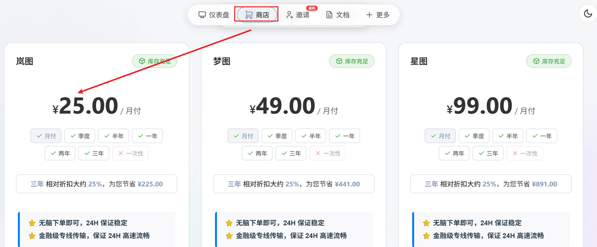
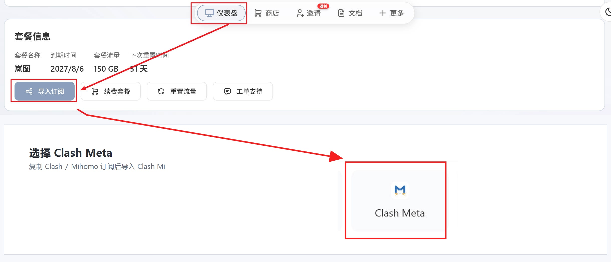
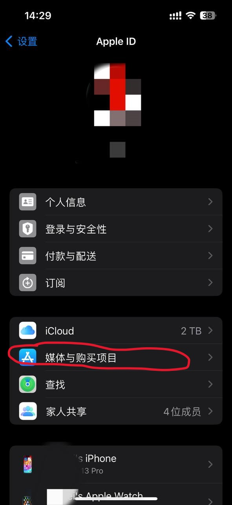
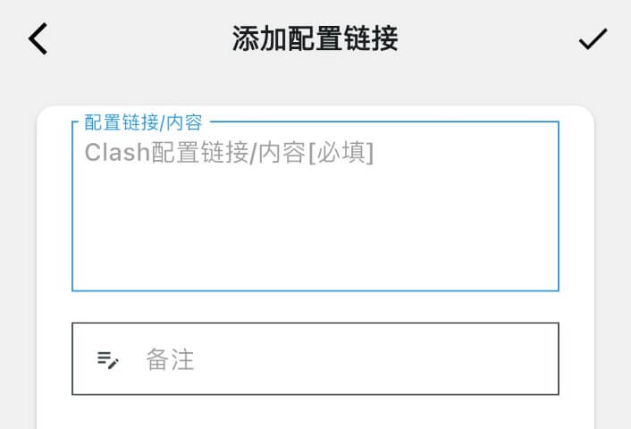
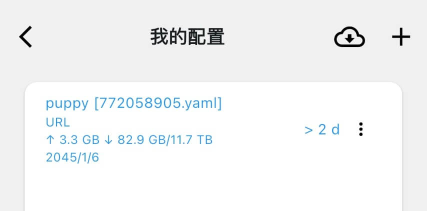
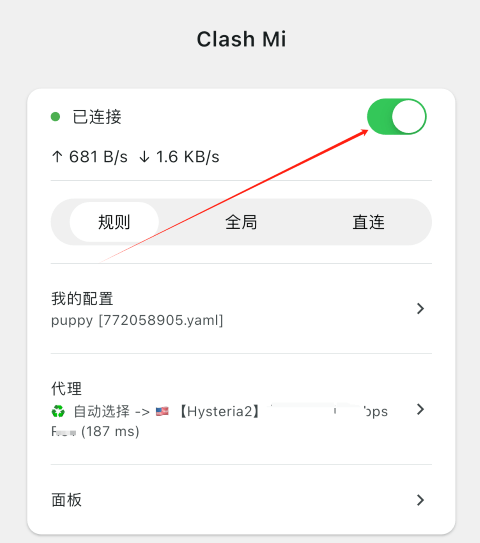
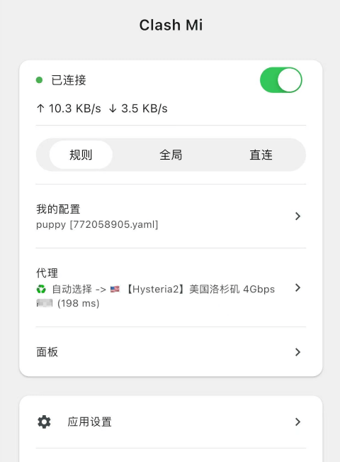

<!-- markdownlint-disable-file MD034 -->

sing-box 的 iOS App Store 版本停止更新后，不建议新用户继续照着旧教程安装。本篇改用 [Clash Mi](https://clashmi.app/)：它免费开源，内置持续维护的 Mihomo（Clash Meta）内核，iOS、Android、Windows、macOS 和 Linux 都有版本，手机与电脑的操作逻辑也基本一致。

本文以手机端为主，不讲复杂原理，只完成“购买订阅、安装客户端、导入配置、开启连接”四件事；最后再补充电脑端和常见故障排查。

> **资料说明：**Clash Mi 的平台支持、系统要求、下载链接和操作步骤均以[官方网站](https://clashmi.app/)、[官方用户手册](https://clashmi.app/guide/)与[官方 GitHub 仓库](https://github.com/KaringX/clashmi)为准，核对时间为 2026-08-16。

## 先看结论：十分钟完成连接

1. 购买支持 **Clash/Mihomo 订阅**的机场，本文首选云图，寰宇云作为备选。
2. 在机场面板复制 Clash/Mihomo 格式的订阅地址。
3. 从 Clash Mi 官网进入对应平台的官方商店或下载页。
4. 打开 `我的配置`，点击右上角 `＋`，选择 `添加配置链接`。
5. 粘贴订阅地址并保存，回到首页开启连接。
6. 保持 `规则` 模式，在 `代理` 中选择“自动选择”或一个可用节点。

客户端只是“车”，机场订阅是“路”，缺少任何一个都不能连接。

## Clash Mi 支持哪些设备

根据 Clash Mi 官方下载页，目前最低系统要求如下：

| 平台 | 最低版本 | 推荐安装入口 |
| --- | --- | --- |
| iPhone / iPad | iOS 15 | [App Store 稳定版](https://apps.apple.com/us/app/clash-mi/id6744321968) |
| Android 手机 / 平板 | Android 8 | [官方下载页](https://clashmi.app/download)或 [GitHub Release](https://github.com/KaringX/clashmi/releases/latest) |
| Windows | Windows 10，x64 | [官方下载页](https://clashmi.app/download) |
| Mac | macOS 12，Intel 与 Apple 芯片 | [官方下载页](https://clashmi.app/download) |
| Linux | 以官方下载页当前说明为准 | [官方下载页](https://clashmi.app/download) |

Clash Mi 本身不提供节点或流量。它只负责读取订阅、连接节点和执行分流规则。

> **最重要的兼容性提醒：**Clash Mi 官方 FAQ 明确说明，它只支持 Clash 格式的 `.yaml` / `.yml` 配置，不支持 sing-box、v2ray 等专用订阅。机场面板如果能选择订阅类型，请选 **Clash、Mihomo 或 Clash Meta**，不要复制旧教程里的 sing-box 专用链接。

## 第一步：购买机场并复制订阅

### 首选：云图机场

云图更适合日常主力使用：全线统一 1 倍率，同时提供第三方订阅和自研客户端。第一次购买建议先月付测试，不要因为长期套餐单价低就一次投入过多。


本站专属 75 折 | uufly
大促 88 折 | yt88


注册后进入 `商店` 购买套餐。流量较少的用户可以选一次性流量包；经常使用再考虑月付或更长周期。



购买完成后回到 `仪表盘`，打开 `一键订阅`。如果页面让你选择客户端或格式，选择 `Clash`、`Mihomo` 或 `Clash Meta`，然后复制订阅地址。



订阅地址相当于账户密钥，通常包含识别信息。不要把完整链接发到群聊、论坛或公开截图中，也不要粘贴到来源不明的“订阅转换”网站。

想先了解线路、倍率和套餐，可以查看[云图机场完整评测](/p/airport-yuntu/)。

### 备选：寰宇云

如果流量需求较大，或希望增加一个不同运营方的备用订阅，可以考虑寰宇云。它提供直连与专线混合线路，也支持第三方订阅；导入 Clash Mi 前同样要确认拿到的是 Clash/Mihomo 格式。


线路升级大促 85 折 | HY888


购买前可以先看[寰宇云机场完整评测](/p/airport-huanyu/)。主力与备用最好不要来自同一家运营方，否则服务商故障时两个订阅可能同时失效。

## 第二步：在手机上安装 Clash Mi

只从 [Clash Mi 官网](https://clashmi.app/)、官方应用商店或 [KaringX/clashmi](https://github.com/KaringX/clashmi) 下载。不要安装搜索广告里的“增强版”“免配置版”或第三方重打包版本。

### iPhone / iPad 安装

1. 使用非中国大陆地区的 Apple 账号登录 App Store。
2. 打开 [Clash Mi 的官方 App Store 页面](https://apps.apple.com/us/app/clash-mi/id6744321968)。
3. 核对名称为 `Clash Mi` 后下载安装。日常使用优先选择 App Store 稳定版，不必安装 TestFlight 测试版。

如果只是切换 App Store 账号，路径通常是 `设置 → 头像 → 媒体与购买项目`。使用共享或临时账号时，只能登录“媒体与购买项目”，**不要把它登录到 iCloud**，以免设备、照片和查找功能被他人账号绑定。



中国大陆区 App Store 无法下载或更新时，需要切换到可以下载该应用的地区账号。已经装过 TestFlight 版又无法更新，可先备份或记下订阅，再卸载测试版并安装 App Store 稳定版。

### Android 安装

1. 打开 [Clash Mi 官方下载页](https://clashmi.app/download)，选择 Android 稳定版；官网无法访问时可用[官方 GitHub Release](https://github.com/KaringX/clashmi/releases/latest)。
2. 官方手册建议选择文件名类似 `clashmi_版本号_android_arm.apk` 的安装包。
3. 浏览器提示 APK 风险时，先再次核对域名或 GitHub 仓库，再仅为本次安装授权“允许安装未知应用”。安装结束后可以关闭该授权。

小米或 MIUI 设备若确定安装包来自官方但仍被增强防护拦截，可按官方说明临时断网并关闭增强防护完成安装，完成后立即恢复安全设置。

## 第三步：导入 Clash/Mihomo 订阅

iOS 和 Android 的主要操作相同，界面文字可能随版本略有变化。

1. 打开 Clash Mi，进入 `我的配置`。
2. 点击右上角 `＋`。
3. 选择 `添加配置链接`。
4. 将刚才复制的 Clash/Mihomo 订阅粘贴到 `配置链接/内容`。
5. `备注` 可以填写“云图”或“寰宇”，然后点击右上角对勾保存。



保存后，配置会出现在列表中。等待下载和解析完成，再确认它已成为当前配置。



如果立即提示订阅格式错误，优先回机场面板重新复制 `Clash` / `Mihomo` 订阅，不要反复修改 Clash Mi 的 DNS、覆写或 TUN 设置。

## 第四步：开启连接并选择节点

回到 Clash Mi 首页，滑动右上角连接开关。第一次连接时，iOS 或 Android 会询问是否允许添加 VPN 配置，选择允许；系统显示 VPN 图标后才算真正启用。



首页建议保持以下设置：

- `规则`：国内网站直连，海外网站按订阅规则代理，适合长期使用。
- `全局`：所有流量走一个代理组。Clash Mi 官方 FAQ 提醒，全局模式的 `GLOBAL` 组可能默认选中直连，新手容易出现“已连接但无法访问”的情况。
- `直连`：所有流量绕过代理，相当于临时关闭代理效果。

点击首页的 `代理`，可以进入代理组：

- 不想手动挑选时，使用机场提供的“自动选择”或“故障转移”。
- 手动选择时，先测试香港、日本、新加坡等距离较近的节点。
- 延迟数字小不代表视频解锁一定正常；Netflix、Disney+、ChatGPT 等服务应按节点标注和实际结果选择。

官方首页示例中，连接状态、模式、当前配置和代理组都集中在同一页：



## 日常怎么更新订阅

机场增加节点、更换线路或刷新订阅后，需要在 Clash Mi 的 `我的配置` 中更新当前配置。不同版本的更新按钮位置可能略有变化，通常位于配置项目的菜单中。

更新失败时按下面顺序处理：

1. 登录机场面板，确认套餐没有过期、流量没有用完。
2. 重新复制 Clash/Mihomo 订阅地址。
3. 在浏览器中确认订阅域名可以访问。
4. 删除失效配置后重新添加新链接。

不要把“更新订阅”和“更新 Clash Mi”混为一件事：前者更新机场节点，后者更新客户端和 Mihomo 内核。

## Windows 和 macOS 怎么用

电脑端的核心步骤没有变化：从官网下载、安装、添加同一条 Clash/Mihomo 订阅，再开启连接。

### Windows

1. 在[官方下载页](https://clashmi.app/download)选择 Windows 稳定版安装包，文件名通常类似 `clashmi_版本号_windows_x64.exe`。
2. 安装后按手机端同样的路径添加订阅。
3. 浏览器等遵循系统代理的程序通常可以直接使用；命令行、游戏或部分桌面软件没有流量时，再考虑开启 TUN。
4. 官方 FAQ 说明，Windows 开启 TUN 遇到 `Access is denied` 时，需要以管理员身份重新启动 Clash Mi。

不要在同一时间开启两个 Clash、VPN 或 TUN 客户端，它们会争抢系统代理和路由。

### macOS

macOS 可以从[官方下载页](https://clashmi.app/download)安装，也可以使用官方仓库给出的 Homebrew 命令：

```bash
brew install clash-mi
```

首次连接时按系统提示允许网络扩展。部分设备只有在 Clash Mi 的系统扩展无法读取自身配置时才需要“完全磁盘访问权限”，无需一开始主动开放所有权限。

## 常见问题排查

### 订阅添加失败

- 确认链接返回的是 Clash YAML 配置，而不是 sing-box、v2ray 或普通节点链接。
- 回机场面板选择 Clash/Mihomo 订阅，尽量不要使用第三方在线转换站。
- 某些机场会根据 User-Agent 下发不同配置，可在 `应用设置 → UserAgent` 按机场说明调整。
- 订阅域名暂时无法直连时，可以先用另一个可用代理下载配置，再回到 Clash Mi 添加。

### 显示已连接，但网页打不开

1. 切回 `规则` 模式，不要停在 `直连`。
2. 打开 `代理`，确认代理组没有选中 `DIRECT` 或失效节点。
3. 更新订阅并换一个节点测试。
4. 手机或电脑只保留一个 VPN/TUN 客户端运行。
5. 仍然没有流量时，在 `核心设置 → TUN` 中启用覆写和 TUN 后重新连接；Windows 需要管理员权限。

### iOS 开启后立刻自动断开

Clash Mi 官方 FAQ 说明，iOS 对 VPN 扩展有严格的内存上限。规则集过大时进程可能被系统终止。先更新 Clash Mi；仍然发生时，联系机场获取更精简的 Clash 配置，减少 geosite、geoip、IP-ASN 等大型规则。

### 能上网，但流媒体或 AI 服务打不开

这通常是出口 IP 或节点解锁问题，不是 Clash Mi 界面问题。切换机场标注的流媒体、原生 IP 或 AI 节点；多个节点都失败时联系机场，而不是反复重装客户端。

### 更新后突然全部失效

先登录机场查看公告。机场可能更换订阅域名、刷新密钥或调整配置格式。重新复制新订阅地址通常比继续使用旧链接排查更快。

## 最后

对于第一次使用的人，最稳妥的顺序是：**先确认 Clash/Mihomo 订阅格式，再用规则模式连接，最后才调整 TUN、DNS 和覆写**。一次只改一个选项，出现问题才知道是哪一步造成的。

需要进一步比较客户端，可以参考 [uuFly Lab 的客户端选择指南](https://lab.uufly.org/zh/getting-started/choose-client)；需要看境外流媒体，可以继续阅读[Netflix、Disney+ 等流媒体教程](/p/netflix-help/)。

## 截图与资料来源

- [Clash Mi 官方网站](https://clashmi.app/)
- [Clash Mi 官方用户手册](https://clashmi.app/guide/)
- [Clash Mi 官方下载页](https://clashmi.app/download)
- [Clash Mi 官方 FAQ](https://clashmi.app/guide/faq)
- [KaringX/clashmi 官方仓库](https://github.com/KaringX/clashmi)

文中的 Clash Mi Logo、首页和配置流程图来自上述官方手册与 GPL-3.0 开源仓库；封面由本站基于官方素材重新排版制作。云图与 Apple 商店账号步骤图来自本站原有教程。

## 更新记录

- 2026-08-16：首次发布，替代已停止更新的 sing-box iOS App Store 版教程；覆盖 iOS、Android、Windows 和 macOS，并补充订阅格式与故障排查。
