🔥🔥🔥：稳定好用的机场/梯子 [TAG 全球250+节点、99+流媒体解锁](https://558343.dedicated-afflink.com/#/auth/2neqgxFl)，更多参考[机场推荐](/p/airport-recommend/)

---

关于云固件相关的资料，请参考 [陆伟峰​的知乎](https://zhuanlan.zhihu.com/p/651550564)，这里不再赘述。

过程是其实和硬件硬盘是一样的，这里只不过是用同样的方式创建虚拟磁盘，然后在 Hyper-V 中启动。

## 云固件文件准备

- 云固件：[r23942（v1.6.23942）](https://pan.baidu.com/share/init?surl=E3LKPlyAZCUX8PhIkIu98Q&pwd=7217)
- Win11 L1 镜像：[Windows 11 专业版 L1基本安装镜像](https://pan.baidu.com/s/1qpRqRhTlG5PTk0EfspJomw)

## 软件准备

- [DiskGenius](https://www.diskgenius.cn/)

## 开始制作

整体还是比较简单的，先创建 vdhx 虚拟磁盘，然后用 DiskGenius 分区，最后然后再把 Win11 L1 镜像拷贝到 创建的 vhdx 中，配置启动镜像即可。

### 创建 vdhx

为了简单，这里给出使用磁盘管理图形界面的创建步骤。

首先打开`计算机管理`，然后点击左边的`磁盘管理`。

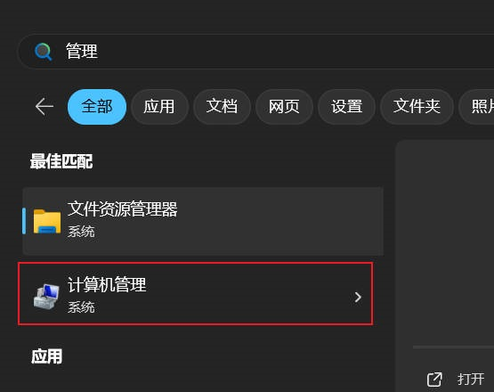

右键，点击`创建VHD`。

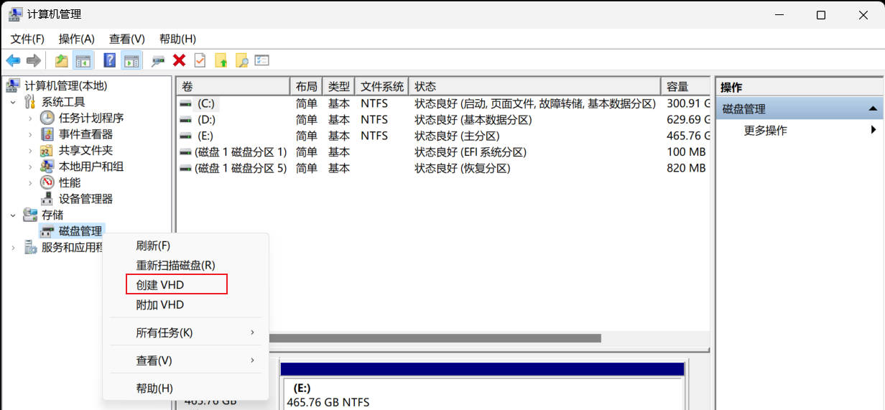

按下图输入大写和选择，注意大小要大于 `260G`，具体原因参考陆大的文章。

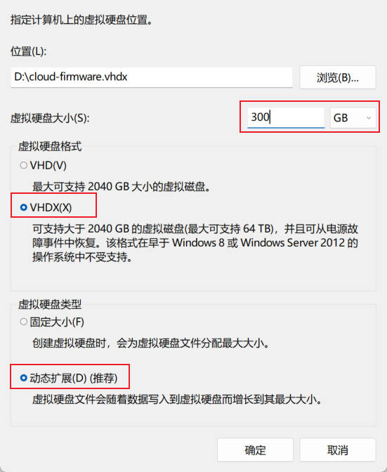

创建之后会自动挂载。

### 分区

```txt
注意：操作千万小心，不要错选磁盘，认证核对，避免数据丢失，数据无价！！！
注意：操作千万小心，不要错选磁盘，认证核对，避免数据丢失，数据无价！！！
注意：操作千万小心，不要错选磁盘，认证核对，避免数据丢失，数据无价！！！
```

打开 `DiskGenius`，选中刚刚创建的虚拟磁盘，然后点击`快速分区`。

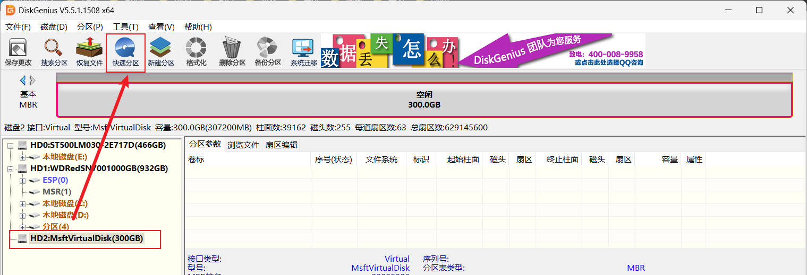

按下图选择，卷标输入 `VDs`，点击`确定`。


执行成功和，`VDs` 应该被自动分配盘符挂载到系统了。


还需要把 `ESP` 分区也挂载到系统，只能在 DiskGenius 中操作。

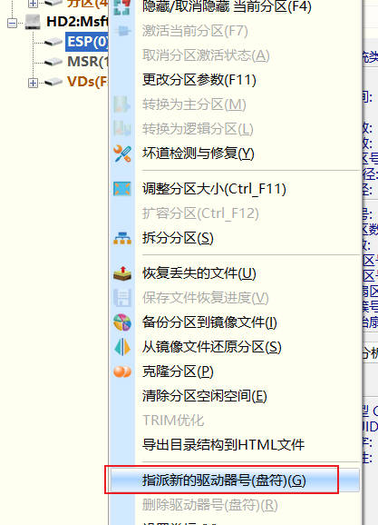


### 复制文件

将云固件解压到 `ESP` 分区，如下图：

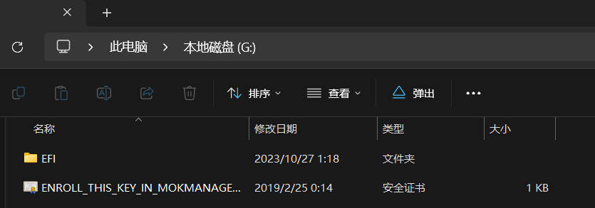

将云固件中的 `vd.config` 拷贝到 `VDs` 分区中。

再将下载的 `Windows 11 专业版 L1基本安装镜像`，目录 `b1882792` 中的 `Windows11-22H2-Pro-L1.7z` 文件解压，解压后删除原文件 `Windows11-22H2-Pro-L1.7z`。

然后将目录 `b1882792` 拷贝到 `VDs` 分区中。目录结构如下。

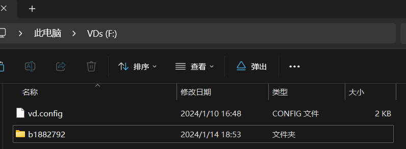

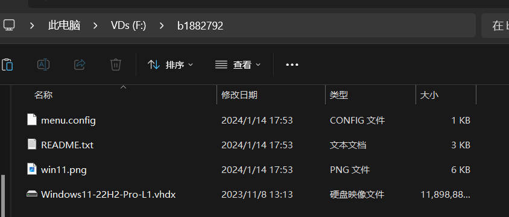

### 分离VHD

（可选）在 `DiskGenius` 中删除 `ESP` 分区的盘符。

在`磁盘管理`中，右键虚拟磁盘，点击`分离VHD`。


至此，Hypver-V 上的云固件虚拟盘就做好了。

## 在 Hyper-V 中创建虚拟机

按如下步骤创建，选择`第二代`，虚拟磁盘选择`使用现有`。

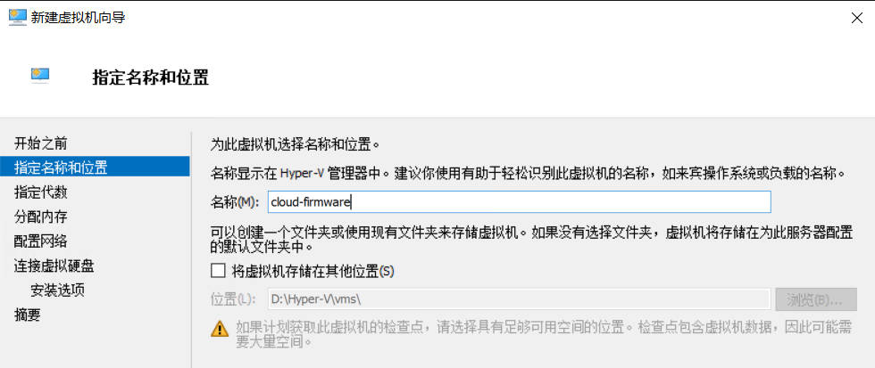

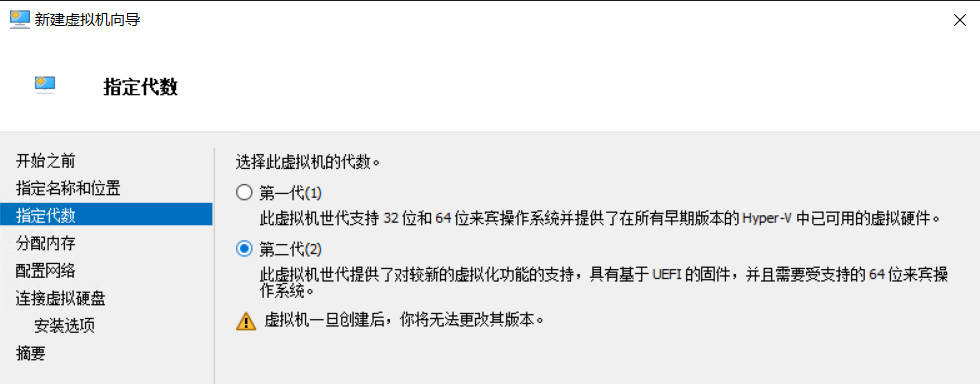

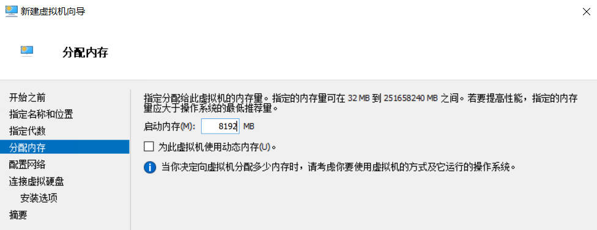

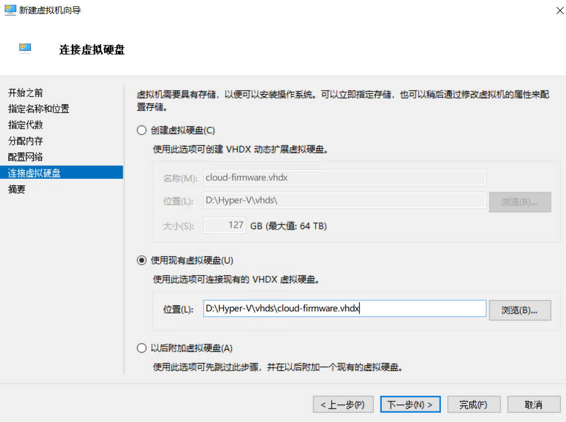

创建完成后，在虚拟机设置中，禁用安全启动。

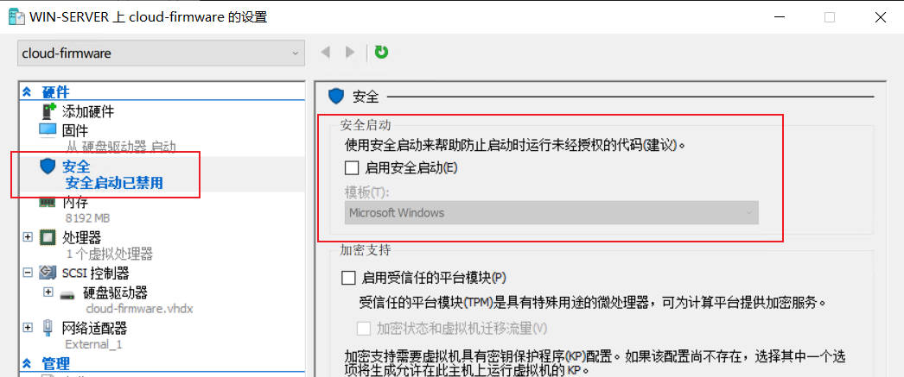

### 启动运行

双击虚拟机，启动运行。


此时，鼠标可能无法使用，请使用 Tab键、方向键和回车键操作。

顺利进入系统。

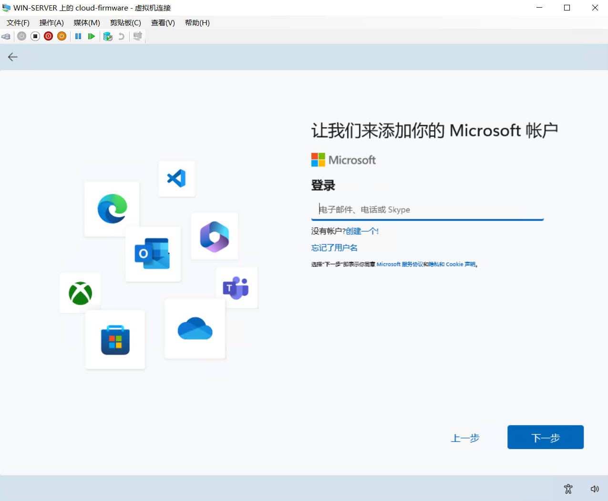

---

## 使用 WinNTSetup 快速制作 Windows L0 镜像

下载 [WinNTSetup](https://msfn.org/board/topic/149612-winntsetup-v533/)。

### vhdx 准备

参考之前步骤，完成虚拟磁盘的创建和分区。

- [创建 vdhx](#创建-vdhx)，大小建议70G以上。
- [分区](#分区)，卷标不用指定。

### 制作过程中自动禁用虚拟磁盘扩充到最大

在目录 `WinNTSetup\RegTweaks\Win10` 下创建 `disable-vdisk-expand.reg`。

这个目录是安装过程中修改注册表的，可以利用此特性预置很多配置。

```reg
Windows Registry Editor Version 5.00

[HKEY_LOCAL_MACHINE\SYSTEM\CurrentControlSet\Services\FsDepends\Parameters]
"VirtualDiskExpandOnMount"=dword:00000004
```

### 使用 WinNTSetup 创建 L0 镜像

打开 `WinNTSetup`。

1. 选择 Windows 安装镜像 ISO，这里以 LSTC 为例。
2. `引导驱动器`选择虚拟磁盘的ESP分区，就是 FAT32 300MB 那个。
3. `系统驱动器`选择虚拟磁盘最大的那个分区，NTFS 那个。
4. `优化调整`里，`注册表调整`选择`Win10`，其余选项按需调整。

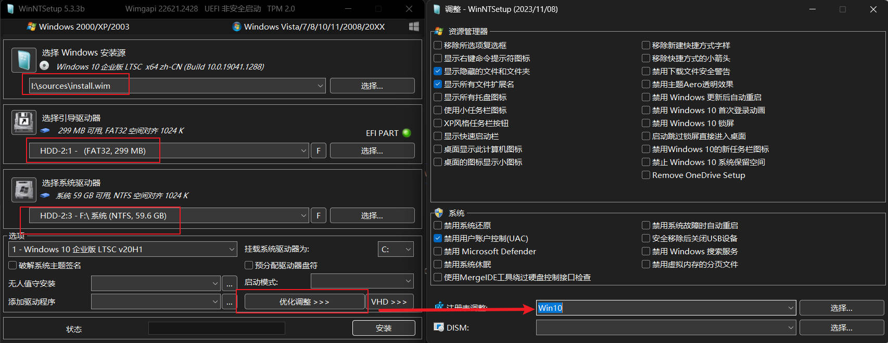

最后点击 `安装`，会提示`不能选择VHD作为引导驱动器`，点击`确定`继续即可。

安装结束会提示`重启`，就不用重启了。

最后分离 VHD，一个 Windows 的 L0 镜像就做好了。
