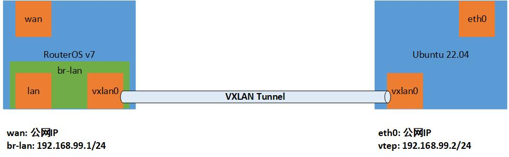
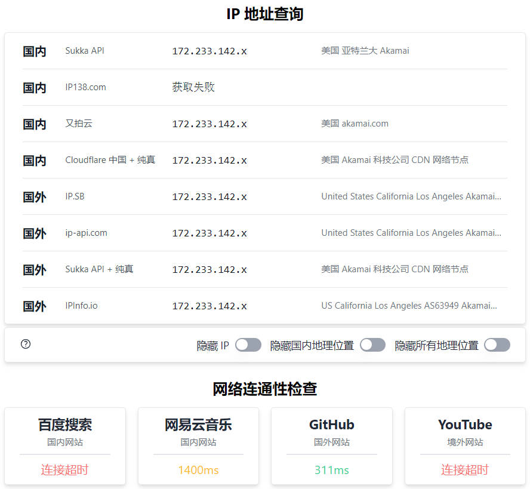

VXLAN（Virtual eXtensible Local Area Network，虚拟扩展局域网），是由 IETF 定义的 NVO3（Network Virtualization over Layer 3）标准技术之一，是对传统 VLAN 协议的一种扩展。VXLAN 的特点是将 L2 的以太帧封装到 UDP 报文（即 L2 over L4）中，并在 L3 网络中传输。

VXLAN 本质上是一种隧道技术，在源网络设备与目的网络设备之间的 IP 网络上，建立一条逻辑隧道，将用户侧报文经过特定的封装后通过这条隧道转发。

关于 VXLAN，这里不展开讲，只需要知道两点：

1. 它是一种隧道技术
2. 它在公有云中被广泛应用

更深入的了解，可以参考[什么是 VXLAN](https://support.huawei.com/enterprise/zh/doc/EDOC1100087027)。

既然是隧道，就可以用它来整活儿。由于被公有云广泛应用，猜测 GFW 对它的审查应该有所放松。记得曾经在某公司云服务的一场会议上，听其高管讲，共有云的跨国流量里，80% 的流量都是非法业务。

既如此，如果用 VXLAN 来科学上网，效果会不会不错？

```txt
先说结论吧：
- 直接把 VXLAN 作为隧道翻墙是不可行的，经测试，由于 VXLAN 并不加密，GFW 的审查应该是会剥离 VXLAN 头部直接审查内部报文。
- 所以，即使经过了 VXLAN 隧道，把 VPS 作为网关，访问情况和国内直接访问一致。
```

## 网络规划

整体思路就是旁路由的思路，直接上图：



划重点：

1. VXLAN 是要双向配置的，所以本地和远端都必须是公网IP。
2. 本地使用 RouterOS 7，当时起个 Liunx 也可以，用 ROS 主要是为了方便配置策略路由来分流。

## 开始配置

以下涉及到公网的 IP 的，使用 `x` 替换了一部分，复制命令时请自行替换。

这里是新拉起了一个 Linode VPS 作为远端服务器，系统使用的是 Ubuntu 22.04。

### VPS 准备工作

#### 1. 禁用防火墙

既然是实验，先禁用防火墙，避免其可能的影响。

```bash
systemctl stop ufw.service
systemctl disable ufw.service
```

#### 2. 开启转发

```bash
vim /etc/sysctl.conf
```

取消以下两行的注释

```conf
net.ipv4.ip_forward=1
net.ipv6.conf.all.forwarding=1
```

再执行

```bash
sysctl -p
```

### RouterOS 准备工作

RouterOS 的配置就不截 winbox 配置界面的图了，命令行和界面基本都能对上，直接贴命令行了。

#### 1. IP服务的安全策略先加上，避免被爆破，导致控制台疯狂输出登录失败日志

```bash
/ip service set telnet address=10.0.0.0/8,172.16.0.0/12,192.168.0.0/16
/ip service set ftp address=10.0.0.0/8,172.16.0.0/12,192.168.0.0/16
/ip service set www address=10.0.0.0/8,172.16.0.0/12,192.168.0.0/16
/ip service set ssh address=10.0.0.0/8,172.16.0.0/12,192.168.0.0/16
/ip service set www-ssl address=10.0.0.0/8,172.16.0.0/12,192.168.0.0/16
/ip service set api address=10.0.0.0/8,172.16.0.0/12,192.168.0.0/16
/ip service set winbox address=10.0.0.0/8,172.16.0.0/12,192.168.0.0/16
/ip service set api-ssl address=10.0.0.0/8,172.16.0.0/12,192.168.0.0/16
```

#### 2. 配置上网，这里是 PPPOE 拨号

修改下接口名字

```bash
/interface ethernet set [ find default-name=ether1 ] name=ether1-wan
/interface ethernet set [ find default-name=ether2 ] name=ether2-lan
```

配置 PPPOE

```bash
/interface pppoe-client add interface=ether2-wan name=pppoe-wan user=<user> password=<password>
```

配置 DNS

```bash
/ip dns set allow-remote-requests=yes servers=223.5.5.5,114.114.114.114
```

### 配置检查

#### 本地 ROS ping VPS

```bash
[root@rostest] > ping 172.233.142.x
  SEQ HOST                                     SIZE TTL TIME       STATUS    
    0 172.233.142.x                             56  47 184ms440us
    1 172.233.142.x                             56  47 184ms340us
    2 172.233.142.x                             56  47 184ms235us
    sent=3 received=3 packet-loss=0% min-rtt=184ms235us avg-rtt=184ms338us max-rtt=184ms440u
```

可以看到网络是通的。

#### VPS ping 本地 ROS 的公网 IP

```bash
root@localhost:~# ping 121.229.x.x
PING 121.229.x.x (121.229.x.x) 56(84) bytes of data.
64 bytes from 121.229.x.x: icmp_seq=1 ttl=40 time=186 ms
64 bytes from 121.229.x.x: icmp_seq=2 ttl=40 time=186 ms
64 bytes from 121.229.x.x: icmp_seq=3 ttl=40 time=186 ms

--- 121.229.x.x ping statistics ---
3 packets transmitted, 3 received, 0% packet loss, time 2002ms
rtt min/avg/max/mdev = 185.582/185.879/186.073/0.213 ms
```

可以看到网络是通的。

### VXLAN: VPS 配置

以下分别为命令行和 netplan 的配置。

#### 命令行

```bash
ip link add vxlan0 type vxlan \
  id 3000 \
  remote 121.229.x.x \
  dstport 4789 \
  local 172.233.142.x \
  dev eth0
ip link set vxlan0 up
ip addr add 192.168.99.2/24 dev vxlan0
```

查看 vxlan0 接口

```bash
root@localhost:~# ifconfig 
vxlan0: flags=4163<UP,BROADCAST,RUNNING,MULTICAST>  mtu 1450
        inet 192.168.99.2  netmask 255.255.255.0  broadcast 0.0.0.0
        inet6 fe80::ec90:6ff:fe88:372d  prefixlen 64  scopeid 0x20<link>
        ether ee:90:06:88:37:2d  txqueuelen 1000  (Ethernet)
        RX packets 0  bytes 0 (0.0 B)
        RX errors 0  dropped 0  overruns 0  frame 0
        TX packets 8  bytes 544 (544.0 B)
        TX errors 0  dropped 0 overruns 0  carrier 0  collisions 0
```

查看路由表，多了下面的内容，所有目的地址是 192.168.99.0/24 网络包要通过 vxlan0 转发：

```bash
root@localhost:~# ip route show 
192.168.99.0/24 dev vxlan0 proto kernel scope link src 192.168.99.2
```

查看 fdb。这个表项的意思是，默认的 VTEP 对端地址为 121.229.x.x。换句话说，原始报文经过 vxlan0 后会被内核添加上 VXLAN 头部，而外部 UDP 头的目的 IP 地址会被冠上 121.229.x.x。

```bash
root@localhost:~# bridge fdb show
00:00:00:00:00:00 dev vxlan0 dst 121.229.x.x via eth0 self permanent
```

#### netplan 配置文件

命令行配置重启后会失效，放到 netplan 里配置持久化。

`/etc/netplan/99-vxlan-config.yaml`

```yaml
network:
  version: 2
  tunnels:
    vxlan0:
      mode: vxlan
      local: 172.233.142.x
      remote: 121.229.x.x
      id: 3000
      port: 4789
      addresses:
        - 192.168.99.2/24
```

### VXLAN: 本地 ROS 配置

先创建 VXLAN，然后再把 VXLAN 接口和 LAN 口桥接。

#### 创建 VXLAN

```bash
/interface vxlan add name=vxlan0 port=4789 vni=3000
/interface vxlan vteps add interface=vxlan0 remote-ip=172.233.142.x
```

#### 桥接 vxlan0 和 ether2-lan

```bash
/interface bridge add name=br-lan
/interface bridge port add bridge=br-lan interface=ether2-lan
/interface bridge port add bridge=br-lan interface=vxlan0
```

#### br-lan 配置 IP

```bash
/ip address add address=192.168.99.1/24 interface=br-lan network=192.168.99.0
```

这里配置的 IP 和 VPS 上给 vxlan0 接口配置的 IP 是相同网段的。

### 测试 VXLAN 隧道

在 VPS 上 ping ROS 的 br-lan 接口的 IP

```bash
root@localhost:~# ping 192.168.99.1
PING 192.168.99.1 (192.168.99.1) 56(84) bytes of data.
64 bytes from 192.168.99.1: icmp_seq=1 ttl=64 time=144 ms
64 bytes from 192.168.99.1: icmp_seq=2 ttl=64 time=144 ms
64 bytes from 192.168.99.1: icmp_seq=3 ttl=64 time=144 ms

--- 192.168.99.1 ping statistics ---
3 packets transmitted, 3 received, 0% packet loss, time 2003ms
rtt min/avg/max/mdev = 144.359/144.400/144.446/0.035 ms
```

在 ROS 上 ping VPS 的 vxlan0 接口的 IP

```bash
[root@rostest] > ping 192.168.99.2
  SEQ HOST                                     SIZE TTL TIME       STATUS    
    0 192.168.99.2                               56  64 144ms271us
    1 192.168.99.2                               56  64 144ms647us
    2 192.168.99.2                               56  64 144ms309us
    sent=3 received=3 packet-loss=0% min-rtt=144ms271us g-rtt=144ms409us max-rtt=144ms647us
```

可以看到，VXLAN 已经互通了。

在 VPS 上再查看一下 fdb，可以看到，本地网络的一些 MAC 地址已经学习过来了，摘取了部分：

```bash
00:00:00:00:00:00 dev vxlan0 dst 121.229.x.x self permanent
ac:82:26:xx:xx:xx dev vxlan0 dst 121.229.x.x self
26:99:ac:xx:xx:xx dev vxlan0 dst 121.229.x.x self
98:3f:60:xx:xx:xx dev vxlan0 dst 121.229.x.x self
```

### 在 VPS 上配置 snat

源地址 NAT 不多说了，不明白的自己查。

```bash
iptables -t nat \
         -A POSTROUTING \
         -s 192.168.99.0/24 \
         -o eth0 \
         -j SNAT \
         --to-source 172.233.142.x
```

配置完查看下，确保配置成功

```bash
root@localhost:~# iptables -nL -t nat
Chain POSTROUTING (policy ACCEPT)
target     prot opt source               destination         
SNAT       all  --  192.168.99.0/24      0.0.0.0/0            to:172.233.142.x
```

## PC 上网测试

把本地电脑的网络配置成：

- 地址: 192.168.99.200
- 掩码: 255.255.255.0
- 网关: 192.168.99.2
- DNS:  8.8.8.8

在 VPS 上 ping 一下 `192.168.99.200`

```bash
root@localhost:~# ping 192.168.99.200
PING 192.168.99.200 (192.168.99.200) 56(84) bytes of data.
64 bytes from 192.168.99.200: icmp_seq=1 ttl=128 time=145 ms
64 bytes from 192.168.99.200: icmp_seq=2 ttl=128 time=144 ms
64 bytes from 192.168.99.200: icmp_seq=3 ttl=128 time=143 ms

--- 192.168.99.200 ping statistics ---
3 packets transmitted, 3 received, 0% packet loss, time 1998ms
rtt min/avg/max/mdev = 143.159/144.091/144.858/0.703 ms
```

可以看到，VPS 和本地 PC 已经连通，并且还是相同网段的二层域。

打开浏览器，打开 [https://ip.skk.moe/](https://ip.skk.moe/) 测试下。



从图中可知，IP 地址已经是 VPS 的公网IP，但是访问阻断情况和国内直接访问一致，并且还额外导致百度无法访问。

再次测试，例如 Apple 等未被 GFW 封锁的网站都是可以正常访问的。


由此可见：由于 VXLAN 并不加密，GFW 的审查应该是会剥离 VXLAN 头部直接审查内部报文，所以访问阻断的结果和国内一致。

## 结论

1. GFW 对 VXLAN 并不会放松审查，但是猜测：VXLAN 报文中含有被阻断的域名、IP，并不会直接导致 GFW 封锁 VPS 的 IP。
2. 由第1点，或许可以采用 VXLAN 报文作为外层包装，从而达到保护 VPS IP 的目的。毕竟各大机场基本都是通过国内公有云中转，而中转流量很大一部分应该跑在 VXLAN 之上。
3. VXLAN 对性能的损失非常小，但由于 VXLAN 的配置需要双向公网 IP，没有公网 IP 的情况下，使用起来有两个思路：
   1. 作为外层包装协议，并不实际创建 VXLAN 隧道；
   2. 使用国内公有云中转，国内外 VPS 直接配置 VXLAN 隧道；
