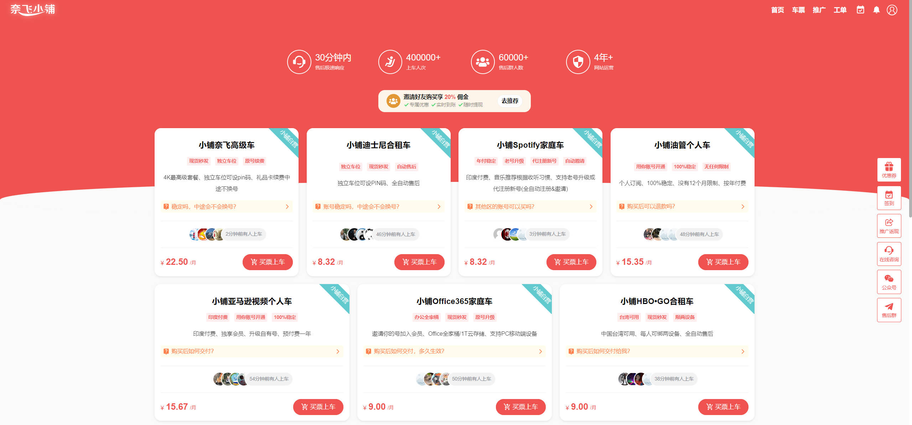

🔥🔥🔥：稳定好用的机场/梯子 [TAG 全球250+节点、99+流媒体解锁](https://tagss08.pro/#/auth/2neqgxFl)，更多参考[机场推荐](/p/airport-recommend/)

---

Nextflix, Disney+ 和 Prime Vedio 是有中文字幕的，推荐在新加坡区观看，账号本身不分区，科学上网节点选择新加坡即可。

## 网络环境

国外的大部分流媒体厂商，基本都禁止了大陆 IP，并且会检测 VPN。所以，一个能解锁流媒体的 VPN 是必备条件。

目前大部分机场，基本都解锁了 Nextflix，其他的流媒体不是都解锁，购买时请注意下说明。[机场推荐](/p/airport-recommend/)。

手机科学上网教程可以参考：[手把手教你科学上网 —— 手机篇（sing-box）](/p/singbox-help-mobile/)

路由器科学上网教程可以参考：[AGuardHome + mosdns + openclash 打造自由的家庭/办公室网络](/p/fuck-gfw/)

## 账号

Nextflix 已经清退了大部分低价区用户，包括土区也无法使用了，在高价区自己订阅不划算，建议直接购买合租账号。

这里推荐一个本人使用快四年的一个合租平台：[奈飞小铺](https://ihezu.zone/Ks3NUR)

都是平台作为号主的自营车，稳定可靠，9 折优惠码: `letsfuckgfw`

## 客户端

网页观看也是可以的，直截了当。

### iOS

iOS 是需要外区账号的，获取外区账号可以参考：[手把手教你科学上网/准备外区账号](/p/singbox-help-mobile/#准备苹果外区账号)。

使用外区账号下载对应客户端，用购买的合租账号登录即可。

**友情提醒，千万别用购买的账号登录 iCloud，否则有手机被锁的风险！**

### 安卓

#### 1. Google Play 商店安装

推荐方式，先安装 谷歌框架 和 Google Play，然后在 Play 商店中安装。

各个品牌手机安装谷歌框架，在 B 站都有教程，自己去搜下。

#### 2. APK 安装

YouTube 和 Nextflix APK 安装后打开软件，可能还会提示需要谷歌框架。

下载 APK 可以使用 [APKPure](https://apkpure.com/cn/)、[APKMirror](https://www.apkmirror.com/) 等。

### 电视端

#### Apple TV

同 iOS 手机端一样，需要外区账号，且激活设备时必须使用外区账号，否则没有 APP Store。因此，如果要使用 Apple TV，建议注册一个自己的外区账号。

Apple TV 无法安装国内视频平台软件。

当然，决定买 Apple TV 的时候，所有的问题应该都考虑到了。

#### 安卓盒子

国产盒子看 Youtube 可以安装 [SmartTube](https://smarttubeapp.github.io/)。

国产电视盒子由于没有 Netflix 认证，即使安装了也看不了高清。

所以建议直接购买境外版的电视盒子，通过 APK 安装国内视频平台软件，可以用得比较舒适。

盒子的选择上推荐：

- Nvidia Shield TV: 有点贵，但是国内使用体验很好，虽然好几年没有出新，但是性能仍然过剩
- Chromecast GoogleTV
- 小米盒子国际版
- FireTV

这些开机需要通过**谷歌账号**激活，注册谷歌账号还是很容易的，但是此时还没进入系统不能安装软件，需要路由器能够科学上网才能正常激活。实在搞不定，购买的时候可以让店家帮忙激活，到手换成自己账号即可。
