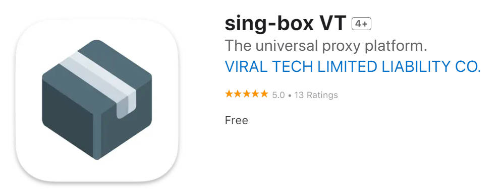

## 手机科学上网需要些什么

- 一部手机（废话）
- 机场/梯子，术语叫代理、VPN，推荐购买 [ChickenRun](https://ccv2.xiaojikp.pro/#/register?code=tqB3FCup)
- 客户端软件，文中使用 [sing-box](https://github.com/SagerNet/sing-box)

打个比喻，客户端软件是车，机场/梯子是路，两个都有了才能跑。

## 说在前面

1. 机场/梯子肯定是要花钱买的！这里给你推荐，但不售卖。
2. Apple iOS 端安装需要外区账号，如果你没本事注册，就花几块钱买，后面会推荐购买平台。

## 具体步骤

不讲原理，只说怎么用。原理可以去参考本博客其他文章。

### 1. 购买机场/梯子

- 推荐买这个：[ChickenRun](https://ccv2.xiaojikp.pro/#/register?code=tqB3FCup)

其他机场可能需要订阅转换才能在 [sing-box](https://github.com/SagerNet/sing-box) 上使用。

以下内容以 [ChickenRun](https://ccv2.xiaojikp.pro/#/register?code=tqB3FCup) 为例。

注册后，选择`购买订阅`购买，不同套餐一般都是流量不一样，按需购买。购买时间越长一般优惠越大，切合自己需求和经济能力购买。

购买完成后，回到`仪表盘`，点击`一键订阅`，再点击`复制订阅地址`，保留好这个地址备用，一会儿再回来复制也行。

### 2. 安装客户端软件

本文推荐使用的是 [sing-box](https://github.com/SagerNet/sing-box)，简单好用。

安卓可以直接下载安装，iOS 需要**外区账号**。

#### Android 安装

Github 官方下载地址：<https://github.com/SagerNet/sing-box/releases>

请选择 `SFA-{版本号}-universal.apk` 下载，因为不是从商店安装的，手机可能会提示风险，一直允许就行。

如果下载太慢，可以使用如下下载加速网站，右键复制链接后，贴到输入框里点击下载。

Github 下载加速：<https://mirror.ghproxy.com/>

#### iOS 安装

由于 iOS 的封闭性，软件只能从 APP Store 安装，然而由于某些不可说的原因，国区商店是没有的，所以只能换**非国区**下载。

##### 准备苹果外区账号

如果你有外区账号，可以跳过本节。

如果你没有外区账号，自行注册外区账号比较复杂，推荐花 ￥6.6 直接购买一个，地区推荐选择美国。

苹果外区账号购买：<https://www.bigplayers.com/shop/detail?id=77&inviteCode=A9245220>

用外区账号登录 APP Store，务必按下图操作，否则有导致手机被锁的风险：

**一定不要使用购买的账号登录 iCloud ！！！**
**一定不要使用购买的账号登录 iCloud ！！！**
**一定不要使用购买的账号登录 iCloud ！！！**

- `设置-->头像-->媒体购买与订阅`
- 点击`媒体购买与订阅`选择`退出登录`
- 再点击一次击`媒体购买与订阅`选择`不是xxx`，输入账号登录

##### 安装 sing-box

回到 APP Store，直接搜索 [sing-box](https://apps.apple.com/us/app/sing-box/id6451272673) 安装即可。

注意看下 Logo 和开发商，别下错了。

### 3. 使用 sing-box

iOS 和 Android 的界面有稍许差别。

#### Android

最下面选择 `Profiles`，点击右下角添加图标，选择 `Create Manually`。然后 Type 选择 `Remote`，Name 可以任意填，URL 填入前面购买获取的订阅地址，最后点击 `Create`。

回到 `Dashboard`，选择刚刚创建的 Profile，点击右下角的三角启动。

首次启动会提示添加 VPN，按提示允许即可。第一次启动时间较长，耐心等待一会儿，直到出现下面第二张图的界面即可使用了。

启动后默认是**规则模式**（Rule，国内外自动分流，可以一直开着不关闭）。节点是**自动选择**，也可按需手动选择。

#### iOS

iOS 需要先点击 `Install Network Extension` 添加 VPN 到系统，如下图。

最下面选择 `Profiles`，点击 `Create`。然后 Type 选择 `Remote`，Name 可以任意填，URL 填入前面购买获取的订阅地址，最后点击 `Create`。

第一次启动时间较长，耐心等待一会儿，直到出现下面第二章图的界面即可使用了。

启动后默认是**规则模式**（Rule，国内外自动分流，可以一直开着不关闭）。节点是**自动选择**，也可按需手动选择。

## 接下来可以干什么

至此，Google、Youtube、Telegram 等等你都可以访问了，总之，自由了！

## 最后

有时候因为特殊原因，机场会刷新订阅地址，如果发现无法使用或者更新不了订阅，请到机场仪表盘重新复制新地址。

👉: [看境外流媒体（Netflix、Disney+ 等）的详细教程](/p/netflix-help/)
