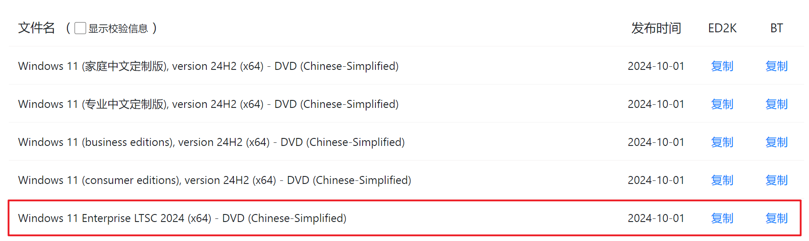

🔥🔥🔥：稳定好用的机场/梯子 [TAG 全球250+节点、99+流媒体解锁](https://558343.dedicated-afflink.com/#/auth/2neqgxFl)，更多参考[机场推荐](/p/airport-recommend/)

---

Windows 11 LSTC 问题总结，持续更新。

## 安装

### 下载

只推荐从 [MSDN, i tell you](https://next.itellyou.cn/) 下载。需要使用 BT 工具，如 Aria2、迅雷等。



### 制作启动盘

使用 [Rufus](https://rufus.ie/zh/) 制作启动 U盘。

### 微软账户登录

LSTC 版本不强制使用微软账户登录，可以跳过。

**TIPs**：安装过程中，不推荐直接使用微软账户登录，应该先创建**纯英文数字**的无密码用户，进入系统后再使用微软账户登录。

### 激活

LSTC 本身属于企业版。

#### 方式一：KMS 激活

自建服务额：[vlmcsd](https://github.com/Wind4/vlmcsd)。多数 OpenWRT 固件都集成了。

公开的 KMS 服务器：[KMS 地址列表](https://www.coolhub.top/tech-articles/kms_list.html)

激活命令：

``` powershell
slmgr /skms kms.03k.org
slmgr /ato
```

#### 方式二：MAS

参考官方：[MAS](https://massgrave.dev/)

## 使用

### 恢复传统右键菜单

以管理员身份运行命令提示符，执行如下命令

``` powershell
reg add "HKCU\Software\Classes\CLSID\{86ca1aa0-34aa-4e8b-a509-50c905bae2a2}\InprocServer32" /f /ve
taskkill /f /im explorer.exe & start explorer.exe
```

还原：

``` powershell
reg delete "HKCU\Software\Classes\CLSID\{86ca1aa0-34aa-4e8b-a509-50c905bae2a2}" /f
taskkill /f /im explorer.exe & start explorer.exe
```

### 应用商店 Microsoft Store

以管理员身份运行命令提示符，执行如下命令

``` powershell
wsreset -i
```

等待，直到开始里出现 Microsoft Store 应用。

### 访问共享文件报错 0X80004005 0x80070035

以管理员身份运行命令提示符，执行如下命令

``` powershell
reg add "HKLM\SYSTEM\CurrentControlSet\Services\LanmanWorkstation\Parameters" /v AllowInsecureGuestAuth /t reg_dword /d 1
reg add "HKLM\SYSTEM\CurrentControlSet\Services\LanmanWorkstation\Parameters" /v RequireSecuritySignature /t reg_dword /d 0
```

### 运行游戏一直弹窗 msgamingoverlay

以管理员身份运行命令提示符，执行如下命令

``` powershell
reg add "HKCU\SOFTWARE\Microsoft\Windows\CurrentVersion\GameDVR" /v AppCaptureEnabled /t reg_dword /d 0
reg add "HKCU\System\GameConfigStore" /v GameDVR_Enabled /t reg_dword /d 0
```

### Office 安装

推荐使用 [Office Tool Plus](https://otp.landian.vip/zh-cn/#) 安装。

安装选项：

- 体系结构：64位
- 产品：Office Mondo 2016 - MondoRetail。**注意：无论是否需要使用 OneDrive，此处都不选择。**
- 语言：简体中文（中国） - zh-cn

安装后激活：

1. 许可证管理 -> 卸载所有许可证
2. 许可证管理 -> 安装许可证：Office Mondo 2016 - 批量许可证
3. KMS 管理 -> KMS 主机：使用 [vlmcsd](https://github.com/Wind4/vlmcsd) 自建或者 [KMS 地址列表](https://www.coolhub.top/tech-articles/kms_list.html)选一个
4. 许可证管理 -> 激活

### OneDrive

#### 下载安装

[下载 OneDrive](https://www.microsoft.com/en-us/microsoft-365/onedrive/download?ocid=ORSEARCH_Bing)

#### 修复资源管理器中 `OneDrive - Personal` 失效问题

该问题是由于 LTSC 注册表无 OneDrive 的 ID {A52BBA46-E9E1-435f-B3D9-28DAA648C0F6} 定义导致。

解决方案是新建一个 `onedrive.reg` 文件，输入如下内容，然后右键 `onedrive.reg` 以管理员身份运行导入注册表。

```reg
Windows Registry Editor Version 5.00

[HKEY_LOCAL_MACHINE\SOFTWARE\Microsoft\Windows\CurrentVersion\Explorer\FolderDescriptions\{A52BBA46-E9E1-435f-B3D9-28DAA648C0F6}]
"Attributes"=dword:00000001
"Category"=dword:00000004
"DefinitionFlags"=dword:00000040
"Icon"=hex(2):25,00,53,00,79,00,73,00,74,00,65,00,6d,00,52,00,6f,00,6f,00,74,\
  00,25,00,5c,00,73,00,79,00,73,00,74,00,65,00,6d,00,33,00,32,00,5c,00,69,00,\
  6d,00,61,00,67,00,65,00,72,00,65,00,73,00,2e,00,64,00,6c,00,6c,00,2c,00,2d,\
  00,31,00,30,00,34,00,30,00,00,00
"LocalizedName"=hex(2):40,00,25,00,53,00,79,00,73,00,74,00,65,00,6d,00,52,00,\
  6f,00,6f,00,74,00,25,00,5c,00,53,00,79,00,73,00,74,00,65,00,6d,00,33,00,32,\
  00,5c,00,53,00,65,00,74,00,74,00,69,00,6e,00,67,00,53,00,79,00,6e,00,63,00,\
  43,00,6f,00,72,00,65,00,2e,00,64,00,6c,00,6c,00,2c,00,2d,00,31,00,30,00,32,\
  00,34,00,00,00
"LocalRedirectOnly"=dword:00000001
"Name"="OneDrive"
"ParentFolder"="{5E6C858F-0E22-4760-9AFE-EA3317B67173}"
"ParsingName"="shell:::{018D5C66-4533-4307-9B53-224DE2ED1FE6}"
"RelativePath"="OneDrive"

[HKEY_LOCAL_MACHINE\SOFTWARE\WOW6432Node\Microsoft\Windows\CurrentVersion\Explorer\FolderDescriptions\{A52BBA46-E9E1-435f-B3D9-28DAA648C0F6}]
"Attributes"=dword:00000001
"Category"=dword:00000004
"DefinitionFlags"=dword:00000040
"Icon"=hex(2):25,00,53,00,79,00,73,00,74,00,65,00,6d,00,52,00,6f,00,6f,00,74,\
  00,25,00,5c,00,73,00,79,00,73,00,74,00,65,00,6d,00,33,00,32,00,5c,00,69,00,\
  6d,00,61,00,67,00,65,00,72,00,65,00,73,00,2e,00,64,00,6c,00,6c,00,2c,00,2d,\
  00,31,00,30,00,34,00,30,00,00,00
"LocalizedName"=hex(2):40,00,25,00,53,00,79,00,73,00,74,00,65,00,6d,00,52,00,\
  6f,00,6f,00,74,00,25,00,5c,00,53,00,79,00,73,00,74,00,65,00,6d,00,33,00,32,\
  00,5c,00,53,00,65,00,74,00,74,00,69,00,6e,00,67,00,53,00,79,00,6e,00,63,00,\
  43,00,6f,00,72,00,65,00,2e,00,64,00,6c,00,6c,00,2c,00,2d,00,31,00,30,00,32,\
  00,34,00,00,00
"LocalRedirectOnly"=dword:00000001
"Name"="OneDrive"
"ParentFolder"="{5E6C858F-0E22-4760-9AFE-EA3317B67173}"
"ParsingName"="shell:::{018D5C66-4533-4307-9B53-224DE2ED1FE6}"
"RelativePath"="OneDrive"
```

### 删除 网络1 网络2 网络3……

删除以下两个注册表位置的所有子项，然后重启电脑即可

- HKEY_LOCAL_MACHINE\SOFTWARE\Microsoft\Windows NT\CurrentVersion\NetworkList\Profiles
- HKEY_LOCAL_MACHINE\SOFTWARE\Microsoft\Windows NT\CurrentVersion\NetworkList\Signatures\Unmanaged
